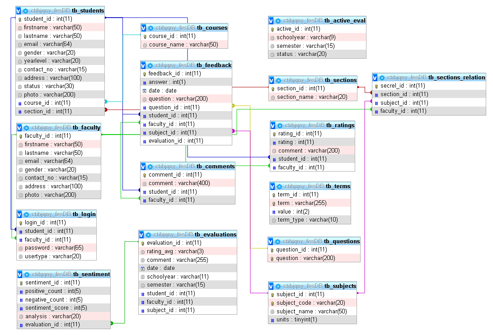

# Faculty Evaluation System SPCC

Faculty Evaluation System (FES) project is developed for Systems Plus Computer College Caloocan! This system is designed to streamline the process of evaluating faculty performance and provide feedback for continuous improvement. Having Sentiment Analysis as it's core feature, faculty members can receive constructive feedback from students, while students can have a platform to voice their opinions and concerns about their learning experiences. This project aims to enhance the quality of education by fostering a culture of continuous improvement within the institution.

## Website

- [Faculty Evaluation System](http://facultyevaluation.elementfx.com/)

## Features

- CRUD for Accounts, Sections, Courses, etc.
- Sentiment Analysis
- Data Tables
- Customizability for Sections relationship with Subjects
- Evaluation Reports (Graphs, Sentiment, Ratings)
- Student and Faculty profiles

## Database Structure

## License

The project does not provide a license, which means modification or distribution outside of the developers and benificaries are prohibited.